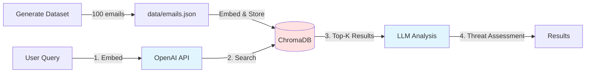
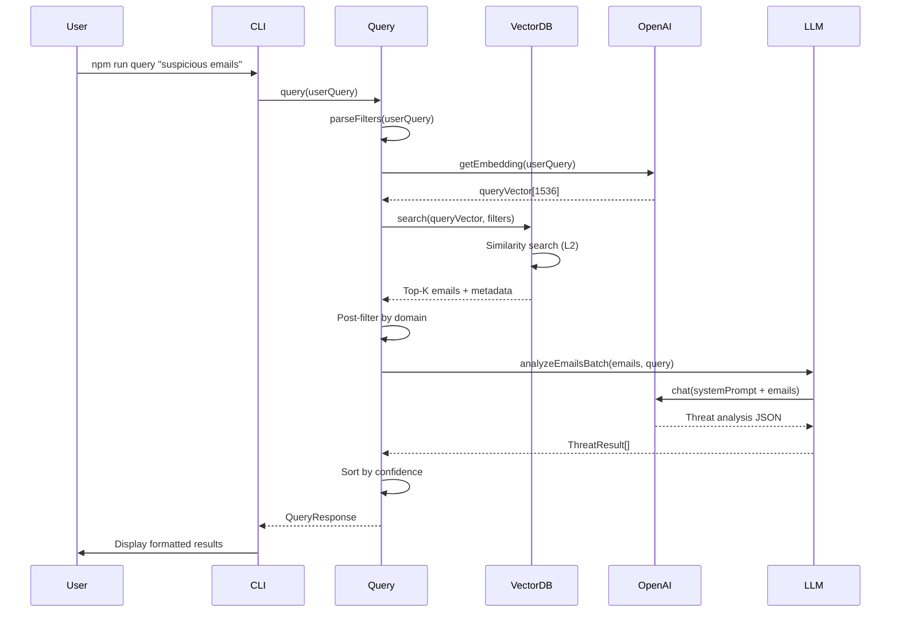

# Email RAG System Architecture

## Overview

This system implements a Retrieval-Augmented Generation (RAG) pipeline for detecting phishing threats in email datasets. It combines semantic vector search with LLM-powered analysis to identify and explain potential security threats.

### Tech Stack

- **Runtime**: Node.js (v20+) with TypeScript (ES2022 target)
- **Execution**: `tsx` for direct TypeScript execution
- **Module System**: ES Modules (`type: "module"`)
- **LLM Provider**: OpenAI
  - Chat & Generation: `gpt-5-nano`
  - Embeddings: `text-embedding-3-small` (1536 dimensions)
- **Vector Database**: ChromaDB (local server with persistence at `./data/chroma-data`)
- **Data Generation**: `@faker-js/faker` for metadata, OpenAI for content

## System Architecture

## Component Details

### 1. Data Generation (`src/generate-dataset.ts`)

- **Input**: Configuration for email count, phishing ratio (60% legitimate, 40% phishing)
- **Process**:
  - **Batch Generation**: 10 emails per LLM API call (configurable via `BATCH_SIZE`)
  - **Structured Output**: LLM returns JSON array `[{"subject": "...", "body": "..."}]`
  - **Metadata**: Faker.js generates realistic sender/recipient details post-generation
  - **Safety Bypass**: Phishing emails use "training example" prompts to bypass safety filters
  - **Post-processing**: Replaces placeholders with realistic fake data via `replacePlaceholders()`
  - **Performance**: ~20x faster than sequential (10 API calls vs ~200 for 100 emails)
- **Output**: `data/emails.json` (100 emails with ground truth labels)

### 2. Ingestion Pipeline (`src/ingest.ts`)

- **Input**: `data/emails.json`
- **Process**:
  - Reads emails in batches of 10
  - Generates embeddings using OpenAI API (1536 dimensions)
  - Formats documents: `From: {name} <{email}>\nSubject: {subject}\n{body}`
  - Upserts to ChromaDB with metadata
- **Output**: Populated vector database at `./data/chroma-data`

### 3. Vector Database (`src/vectordb.ts`)

- **Technology**: ChromaDB (local server on localhost:8000)
- **Storage**:
  - **Documents**: Formatted email text for semantic search
  - **Metadata**: Structured fields (sender, subject, timestamp, isPhishing, etc.)
  - **Embeddings**: 1536-dimensional vectors
- **Operations**: Collection management, upsert, similarity search, filtering

### 4. Query Pipeline (`src/query.ts`)

#### Step 1: Filter Parsing

- Extracts filters from natural language:
  - "with attachment" → `hasAttachment: true`
  - "from gmail" → `senderDomain: gmail.com`
  - "external" → `senderDomain: external`

#### Step 2: Query Embedding

- Converts user query to 1536-dim vector using same embedding model

#### Step 3: Hybrid Search

- **Semantic Search**: Vector similarity (L2 distance)
- **Metadata Filtering**: ChromaDB where clauses for structured fields
- **Domain Filtering**: Post-search in-memory filtering (ChromaDB doesn't support `$contains`)

#### Step 4: Batch LLM Analysis

- Single API call analyzes all retrieved emails
- System prompt: Cybersecurity analyst role
- User prompt: Emails + query context
- Output: Structured JSON with threat assessments

#### Step 5: Result Ranking

- Sorts by confidence score (0-1 scale)
- Returns with explanations and threat indicators

### 5. LLM Integration (`src/llm.ts`)

- **Chat**: gpt-5-nano for generation and analysis
- **Embeddings**: text-embedding-3-small (1536 dims)
- **Configuration**: Environment variables for model selection

### 6. CLI Interface (`src/index.ts`)

- **Modes**:
  - `npm run generate`: Create synthetic dataset
  - `npm run ingest`: Populate vector database
  - `npm run query "<query>"`: Single query mode
  - `npm run interactive`: Continuous query loop
  - `npm run inspect`: View database contents

## Data Flow

## Key Design Decisions

### 1. Batch Processing

- **Dataset Generation**: 10 emails per LLM call with structured JSON output (~20x faster)
- **Embeddings**: Process 10 emails per API call (reduces latency)
- **Analysis**: Single LLM call for all retrieved emails (10x faster, more cost-effective)

### 2. Hybrid Search Strategy

- **ChromaDB Filters**: Used for exact matches (`hasAttachment`, `isPhishing`)
- **Post-filtering**: Used for partial matches (`sender` domain) due to API limitations
- **Semantic Search**: Primary retrieval mechanism for threat patterns

### 3. Document Format

- Combined text format for semantic search: `From: ... Subject: ... Body`
- Structured metadata for filtering and display
- Preserves context while enabling efficient retrieval

### 4. Safety Bypass for Phishing Generation

- Request "training examples" instead of "generate phishing emails"
- Use placeholders: `[VERIFICATION LINK]` → replaced post-generation
- Maintains ethical use while creating realistic training data

### 5. Vector Database Choice

- **ChromaDB**: Lightweight, local-first, easy setup
- **Persistence**: `./data/chroma-data` for data durability
- **Distance Metric**: L2/Euclidean (0 = identical, higher = more different)

## Performance Characteristics

- **Dataset Generation**:
  - Batch processing: 10 emails per API call
  - ~20x speedup: 10 calls vs ~200 for 100 emails
  - Structured JSON output for reliable parsing
- **Query Latency Optimization**:
  - Embedding generation: by requests batching
  - Vector search: minimal as ChromaDB is local
  - LLM batch analysis: single call for multiple emails
- **Cost Efficiency**: Reduced API calls via batching (generation, embedding, analysis)
- **Scalability**: Handles 100+ emails; can scale to thousands with ChromaDB

## Security Considerations

- API keys stored in `.env` (not committed)
- Ground truth labels (`isPhishing`) available for validation
- System designed for training/demo purposes, not production deployment
